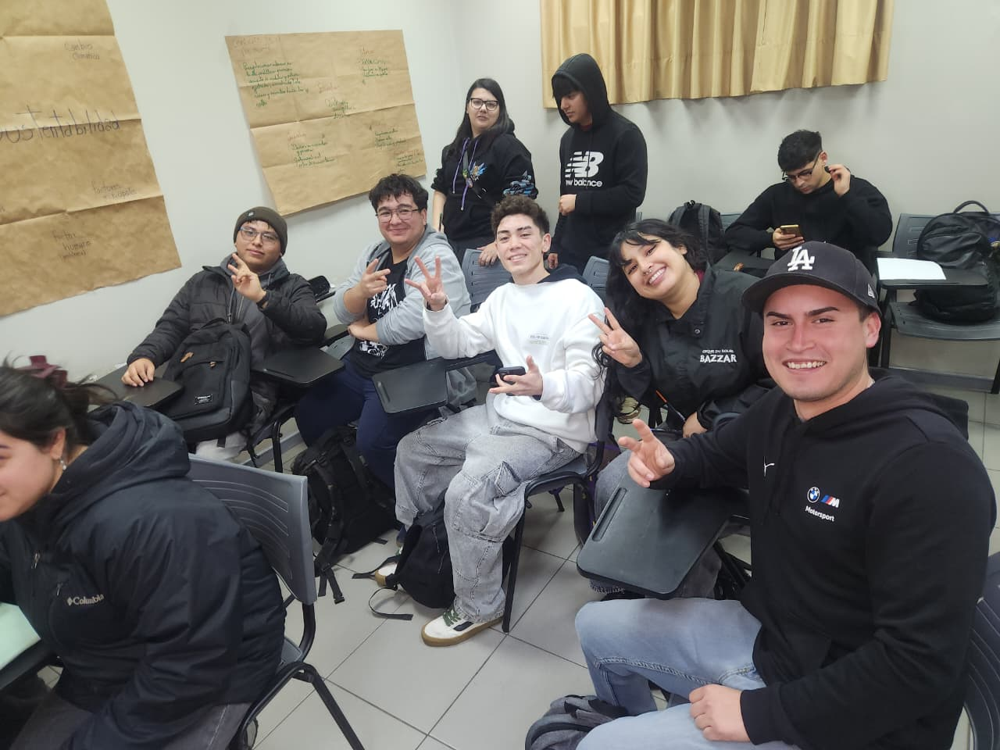

# DESAFÍO 04 | SOSTENIBILIDAD

## Capstone Intermedio 2026

**Equipo:** Los destructores  
**Desafío:** Gestión y medición de residuos reciclables del Hub
**Contraparte:** Municipalidad de Providencia / Hub Providencia  
**Estado actual:** En desarrollo

## Descripción

En el contexto del Hub Providencia, el edificio genera diversos residuos reciclables pero carece de un sistema consolidado para registrar, medir y analizar su generación y recuperación. Estamos abordando este problema mediante el diseño de una solución que permita cuantificar estos residuos y generar un panel de indicadores ambientales. Este proyecto beneficiará directamente al equipo de gestión del Hub, a los laboratorios y a las personas usuarias del edificio, facilitando la toma de decisiones y fortaleciendo las prácticas de economía circular.

## Equipo

| Integrante | Carrera o especialidad | Rol inicial | Usuario de GitHub |
|---|---|---|---|
| Sebastián Díaz | Ing civil Informatica | [Rol] | @sebastiandiazlo-glitch |
| Rivaldo Rodriguez | Ing civil Electronica | [Rol] | @riva250 |
| Jorge Ormazábal | Ing civil Industrial | [Rol] | @JorgeOrmazabal |
| Sebastian Baez | Ing civil industrial | [Rol] | @seba0404 |
| Camila Gortaire | Ing civil Informatica | [Rol] |  |

## Valores del equipo

- Empatía y Apoyo Mutuo: Escuchar activamente las ideas del equipo y colaborarnos en áreas donde algún integrante tenga menor dominio técnico.
- Transparencia: Mantener comunicación abierta sobre el avance del trabajo, bloqueos y dificultades cotidianas.
- Rigor y evidencia: cada afirmación sobre el problema se respalda con datos, observaciones o fuentes registradas en la bitácora.

## Normas de funcionamiento

1. Transparencia en el trabajo: Subir los avances al repositorio de forma progresiva y evitar acumular todo el código o la documentación para el último día
2. Puntualidad y asistencia: Conectarse puntualmente a las reuniones y avisar con anticipación ante cualquier imprevisto de fuerza mayor.
3. Uso de la bitácora: Registrar formalmente todas las decisiones, cambios de diseño y pruebas realizadas en la bitácora de GitHub de acuerdo con el ciclo de iteración del curso.
4. Cómo resolveremos desacuerdos: Mediante un espacio de diálogo enfocado en los datos y la evidencia de las pruebas; si persiste el desacuerdo, se buscará la opinión del equipo docente como guía.
5. Cómo registraremos las decisiones: Todas las actas, acuerdos y cambios de diseño quedarán estipulados por escrito en las minutas y commits estructurados de la bitácora.

## Desafío inicial

Qué sabemos: El Hub Providencia genera residuos reciclables, pero carece de un registro automatizado o consolidado. Tenemos un equipo interdisciplinario (industrial, informático y electrónico) listo para abordar la solución.

Qué todavía no sabemos: Los flujos exactos de retiro, los horarios críticos de acumulación y los requerimientos específicos de visualización de la administración.

Qué supuestos debemos comprobar: Suponemos que los usuarios separarán mejor sus residuos si existen herramientas de medición adecuadas y que la administración está dispuesta a integrar nuevas tecnologías de control.

## Objetivo SMART del equipo

Crear y probar un primer prototipo funcional que mida y registre los residuos reciclables del Hub Providencia, juntando la programación, el diseño de procesos y los circuitos electrónicos, antes de finalizar el semestre, para que la administración pueda ver de forma clara los datos de reciclaje y mejorar la economía circular del edificio.
## Compromisos individuales

| Integrante | Compromiso SMART |
|---|---|
|  Sebastián Díaz | Participar activamente en el desarrollo del proyecto, aportando ideas y cumpliendo con las tareas que me sean asignadas durante el desarrollo del desafío |
| Rivaldo Rodriguez | Configurar y ordenar el repositorio del equipo en GitHub creando las carpetas (bitacora, imagenes, codigos), subiendo los avances semanales, durante todo el semestre, decisiones y código del proyecto queden claros y ordenados. |
| Sebastián Báez | Apoyar al grupo con mis conocimientos, responder oportunamente las dudas o mensajes y cumplir a tiempo con las tareas asignadas para hacer avanzar el proyecto |
| Jorge Ormazábal | Participar activamente en el desarrollo de actividades, aportando ideas y respondiendo dudas del equipo. |
| Camila Gortaire | Contribuir activamente en el desarrollo del proyecto cumpliendo con las tareas de programación y documentación que se me asignen dentro del plazo acordado por el equipo, entregando avances revisables cada semana y comunicando de forma oportuna cualquier dificultad o retraso, durante todo el semestre. |

## Usuarios y contexto

**¿Quiénes viven el problema?** El equipo de gestión del Hub, que hoy no puede reportar cuánto residuo reciclable se genera ni se recupera, los laboratorios y espacios comunes, que son puntos de generación; y las personas usuarias del edificio (estudiantes, personal de laboratorios y oficinas), que separan residuos sin recibir retroalimentación.

**¿Dónde ocurre?** En oficinas, laboratorios y espacios comunes del edificio del Hub Providencia (Los Jesuitas 881, comuna de Providencia, Santiago).

**¿Qué evidencia tienen hasta ahora? El enunciado del curso confirma que no existe un registro consolidado; el mapa conceptual de S02 identifica actores, causas e impactos; y quedan dos preguntas abiertas sin responder (si ya existen puntos de reciclaje en el Hub y cuántos deberían ser). Falta evidencia de terreno, que se levantará en las próximas sesiones.

## Plan inicial

| Actividad | Responsable(s) | Fecha | Estado |
|---|---|---|---|
| Revisar en equipo el enunciado del desafío y alinear la comprensión del problema | Todo el equipo | 30-08-2026 | Hecho |
| Construir el mapa conceptual del desafío | Todo el equipo | 25-08-2026 | Hecho |

## Índice de la bitácora

- [S01 - Identidad del equipo y desafío](bitacora/S01.md)
- [S02 - Empatizar](bitacora/S02.md)

## Evidencias principales

- [Mapa conceptual del desafío (S02)](imagenes/S02/Mapaconceptual.jpeg)
- [Foto del equipo en la primera sesión](imagenes/S02/FotoGrupal.jpeg)
- [Mapa de empatía del desafío](imagenes/S02/Mapadeempatia.png)
- [Bitácora S01 - Identidad del equipo y desafío](bitacora/S01.md)
- [Bitácora S02 - Mapa conceptual](bitacora/S02.md)

## Decisiones relevantes

| Fecha | Decisión | Evidencia o criterio utilizado |
|---|---|---|
| 18-08-2026 | Nombre del equipo "Los destructores" y contrato de funcionamiento | Acuerdo unánime en S01, registrado en la bitácora |
| 25-08-2026 | Mantener el foco en entender y medir antes que en soluciones | Enunciado del desafío y preguntas abiertas del mapa conceptual de S02 |
| 25-08-2026 | El factor humano se trata como parte del problema, no como un supuesto | Mapa conceptual de S02 lo identifica como causa principal |

## Próximo hito

Cerrar la etapa de comprensión del problema.

## Uso y licencia

[Por definir con el equipo docente y la contraparte. No reutilizar ni publicar información reservada sin autorización.]
