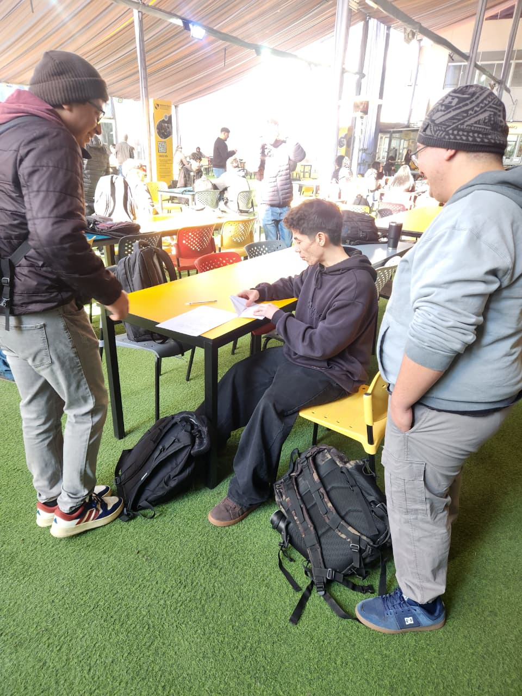

# DESAFÍO 04 | SOSTENIBILIDAD

## Capstone Intermedio 2026

**Equipo:** Los destructores  
**Desafío:** Gestión y medición de residuos reciclables del Hub
**Contraparte:** Municipalidad de Providencia / Hub Providencia  
**Estado actual:** En desarrollo

## Descripción

En el contexto del Hub Providencia, el edificio genera diversos residuos reciclables pero carece de un sistema consolidado para registrar, medir y analizar su generación y recuperación. Estamos abordando este problema mediante el diseño de una solución que permita cuantificar estos residuos y generar un panel de indicadores ambientales. Este proyecto beneficiará directamente al equipo de gestión del Hub, a los laboratorios y a las personas usuarias del edificio, facilitando la toma de decisiones y fortaleciendo las prácticas de economía circular.

## Equipo

| Integrante | Carrera o especialidad | Rol inicial | Usuario de GitHub |
|---|---|---|---|
| Sebastián Díaz | Informatica | [Rol] | @sebastiandiazlo-glitch |
| Rivaldo Rodriguez | Electronica | [Rol] | @riva250 |
| [Nombre] | [Carrera] | [Rol] | [@usuario] |
| [Nombre] | [Carrera] | [Rol] | [@usuario] |

## Valores del equipo

- Empatía y Apoyo Mutuo: Escuchar activamente las ideas del equipo y colaborarnos en áreas donde algún integrante tenga menor dominio técnico.
- Transparencia: Mantener comunicación abierta sobre el avance del trabajo, bloqueos y dificultades cotidianas.
- [Valor 3]

## Normas de funcionamiento

1. Transparencia en el trabajo: Subir los avances al repositorio de forma progresiva y evitar acumular todo el código o la documentación para el último día
2. Puntualidad y asistencia: Conectarse puntualmente a las reuniones y avisar con anticipación ante cualquier imprevisto de fuerza mayor.
3. Uso de la bitácora: Registrar formalmente todas las decisiones, cambios de diseño y pruebas realizadas en la bitácora de GitHub de acuerdo con el ciclo de iteración del curso.
4. Cómo resolveremos desacuerdos: Mediante un espacio de diálogo enfocado en los datos y la evidencia de las pruebas; si persiste el desacuerdo, se buscará la opinión del equipo docente como guía.
5. Cómo registraremos las decisiones: Todas las actas, acuerdos y cambios de diseño quedarán estipulados por escrito en las minutas y commits estructurados de la bitácora.

## Desafío inicial

Qué sabemos: El Hub Providencia genera residuos reciclables, pero carece de un registro automatizado o consolidado. Tenemos un equipo interdisciplinario (industrial, informático y electrónico) listo para abordar la solución.

Qué todavía no sabemos: Los flujos exactos de retiro, los horarios críticos de acumulación y los requerimientos específicos de visualización de la administración.

Qué supuestos debemos comprobar: Suponemos que los usuarios separarán mejor sus residuos si existen herramientas de medición adecuadas y que la administración está dispuesta a integrar nuevas tecnologías de control.

## Objetivo SMART del equipo

Crear y probar un primer prototipo funcional que mida y registre los residuos reciclables del Hub Providencia, juntando la programación, el diseño de procesos y los circuitos electrónicos, antes de finalizar el semestre, para que la administración pueda ver de forma clara los datos de reciclaje y mejorar la economía circular del edificio.
## Compromisos individuales

| Integrante | Compromiso SMART |
|---|---|
| Sebastián Díaz | Participar activamente en el desarrollo del proyecto, aportando ideas y cumpliendo con las tareas que me sean asignadas durante el desarrollo del desafío |
| Rivaldo Rodriguez | Configurar y ordenar el repositorio del equipo en GitHub creando las carpetas (bitacora, imagenes, codigos), subiendo los avances semanales, durante todo el semestre, decisiones y código del proyecto queden claros y ordenados. |
| [Nombre] | [Compromiso] |

## Usuarios y contexto

[¿Quiénes viven el problema? ¿Dónde ocurre? ¿Qué evidencia tienen hasta ahora?]

## Plan inicial

| Actividad | Responsable(s) | Fecha | Estado |
|---|---|---|---|
| [Actividad] | [Nombre] | [dd-mm-aaaa] | Pendiente |
| [Actividad] | [Nombre] | [dd-mm-aaaa] | Pendiente |

## Índice de la bitácora

- [S01 - Identidad del equipo y desafío](bitacora/S01.md)
- [S02 - Levantamiento inicial](bitacora/S02.md)
- [S03 - Empatizar](bitacora/S03.md)

## Evidencias principales

- [Enlace a una prueba, fotografía, dato o documento]
- [Enlace a una prueba, fotografía, dato o documento]

## Decisiones relevantes

| Fecha | Decisión | Evidencia o criterio utilizado |
|---|---|---|
| [dd-mm-aaaa] | [Decisión] | [Evidencia] |

## Próximo hito

[Indiquen qué debe lograr el equipo a continuación y cómo comprobarán que lo consiguió.]

## Uso y licencia

[Por definir con el equipo docente y la contraparte. No reutilizar ni publicar información reservada sin autorización.]
