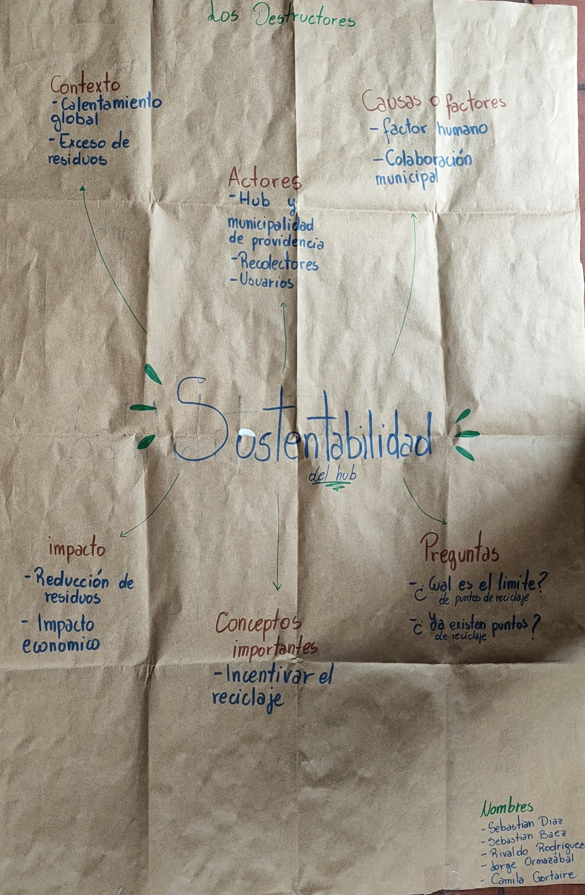
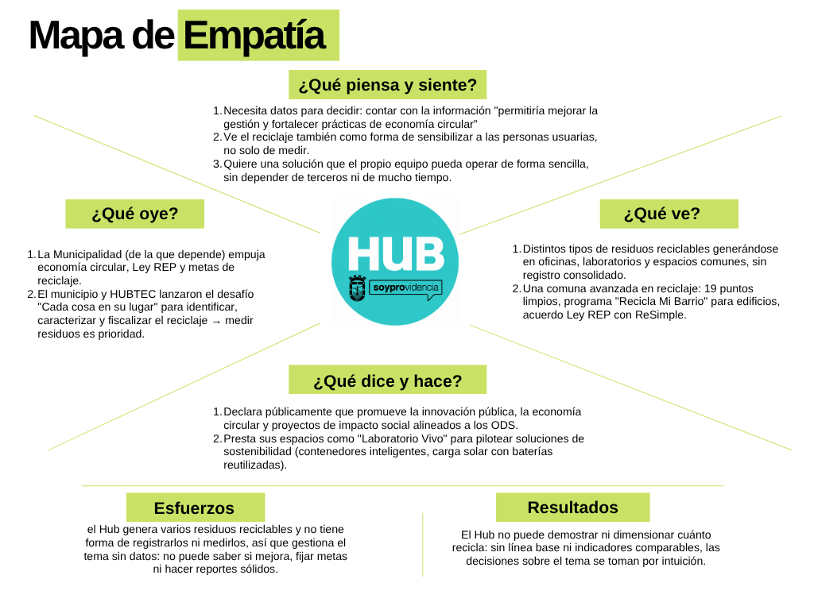

# S02 - Mapa conceptual

**Fecha:** 25-08-2026  
**Participantes:** Sebastián Díaz, Camila Gortaire, Jorge Ormazábal, Rivaldo Rodríguez, Sebastián Baez  
**Responsable del registro:** Sebastián Díaz

## Objetivo

Crear mapa conceptual y mapa de empatía y ver todo lo que el equipo entiende hasta ahora sobre el desafío, distinguiendo lo que sabemos de lo que suponemos, antes de salir a levantar información. En esta etapa el foco es comprender el problema, no proponer soluciones.

## Actividades realizadas

1. Repaso del enunciado del Desafío 04 y de la definición acordada en S01.
2. Lluvia de ideas por categorías y construcción del mapa conceptual en papel kraft.
3. Construcción del mapa de empatía tomando como usuario al Hub Providencia (su equipo de gestión).
4. Investigación de fuentes públicas sobre el Hub y sobre la gestión de residuos en Providencia.
5. Registro fotográfico y subida al repositorio.

## Evidencias

## Resultados

 El Hub no puede demostrar ni dimensionar cuánto recicla: sin línea base ni indicadores comparables, las decisiones se toman por intuición.

## Decisiones y justificación

| Decisión | Evidencia o criterio | Consecuencia para el proyecto |
|---|---|---|
| Mantener el foco en "entender y medir" antes que en soluciones | El enunciado pide comprender el problema en esta etapa; los mapas mostraron varias preguntas sin responder | Las próximas sesiones se dedican al levantamiento, cualquier propuesta de solución se pospone hasta cerrar la etapa de comprensión |
| Tomar al Hub (su equipo de gestión) como usuario del mapa de empatía | En este desafío quien pide y usará la solución es la institución | El levantamiento se enfoca en el equipo de gestión del Hub |
| Tratar el "factor humano" como parte del problema y no como un supuesto aparte | En el mapa conceptual apareció como una de las causas principales | Se incluirán preguntas sobre hábitos de separación en el levantamiento |

## Errores, dificultades o riesgos

- **No funcionó del todo separar "causas" de "impactos"** en el mapa conceptual: al principio mezclamos ambas. Fue por falta de una definición común de cada categoría. Lo corregimos escribiendo una frase que define cada rama antes de llenarla.
- **Parte de el mapa de empatía son supuestos:** sin hablar con el Hub no podemos afirmar qué piensa o siente su equipo.
- **Riesgo:** como equipo tendemos a saltar a la solución (contenedores, sensores, app) antes de entender el problema. 

## Aprendizajes

Ahora entendemos que la sostenibilidad del Hub depende tanto de medir bien como de los hábitos de las personas, y que hay actores externos (municipio, recolectores) que influyen en el resultado. El mapa conceptual nos sirvió para alinear el lenguaje, el mapa de empatía nos obligó a ponernos en el lugar de quien nos encarga el proyecto el Hub como institución y a darnos cuenta de que gran parte de lo que creíamos saber son en realidad supuestos que hay que validar.

## Tareas y responsables

| Tarea | Responsable(s) | Fecha límite | Estado |
|---|---|---|---|
| Subir la fotografía del mapa de empatía dibujado a `imagenes/S02/` | Todo el equipo | 01-09-2026 | Listo |
| Preparar el pitch del tema (no de la solución) y la ficha del desafío para la evaluación | Todo el equipo | 01-09-2026 | Pendiente |
| Crear el mapa de empatía | Todo el equipo | 01-09-2026 |Listo | 
| Visitar el HUB | Todo el equipo | 14-09-2026 | Pendiente |

## Próximo paso

Preparar y presentar el **pitch del tema** y la **ficha del desafío** para la evaluación de la próxima clase, con la bitácora al día.

## Fuentes consultadas

- Enunciado del "Desafío 04 | Sostenibilidad", Curso Capstone Intermedio 2026, Universidad Mayor.
- Material del curso Capstone Intermedio 2026, Clase 3: comprensión del problema (mapa conceptual y mapa de empatía) y comunicación oral.
- Municipalidad de Providencia. "HUB Providencia" (centro de innovación pública). https://providencia.cl/provi/site/artic/20191001/pags/20191001171155.html
- Municipalidad de Providencia. "Providencia inaugura LAB881, el primer laboratorio municipal de impresión 3D del país." https://providencia.cl/provi/explora/noticias/hub-providencia/lab881-el-primer-laboratorio-municipal-de-impresion-3d-del-pais
- EntNerd. "HUB Providencia: el espacio municipal que se configura como nuevo polo de la innovación nacional." https://www.entnerd.com/hub-providencia-municipal-cowork-incubadora-nuevo-polo-innovacion-nacional/
- Municipalidad de Providencia / HUBTEC. "Providencia lanza desafío en reciclaje y programa de formación municipal" (desafío "Cada cosa en su lugar"). https://providencia.cl/provi/explora/noticias/hub-providencia/providencia-lanza-desafio-en-reciclaje-y-programa-de-formacion-municipal
- Municipalidad de Providencia. "Proyectos de Innovación se instalan en espacios municipales generando impacto social en Providencia" (contenedor inteligente Redciclach, Laboratorio Vivo). https://providencia.cl/provi/explora/noticias/hub-providencia/proyectos-de-innovacion-se-instalan-en-espacios-municipales-generando
- Municipalidad de Providencia. "Providencia reciclará los residuos de todos los edificios de la comuna" (programa Recicla Mi Barrio, toneladas y metas). https://providencia.cl/provi/noticias/medio-ambiente/providencia-reciclara-los-residuos-de-todos-los-edificios-de-la-comuna
- ¿Cuál es tu huella? "Conoce los puntos limpios de reciclaje en Providencia (actualizado 2025)." https://www.cualestuhuella.cl/noticia/puntos-limpios/2025/07/conoce-los-puntos-limpios-de-reciclaje-en-providencia-actualizado-2025
- País Circular. "Reciclaje domiciliario llega a Providencia tras acuerdo entre ReSimple y municipio." https://www.paiscircular.cl/economia-circular/nuevo-sistema-de-reciclaje-domiciliario-en-providencia/
- Ministerio del Medio Ambiente de Chile. "Ley 20.920 – Responsabilidad Extendida del Productor (Ley REP)." https://economiacircular.mma.gob.cl/ley-rep/
