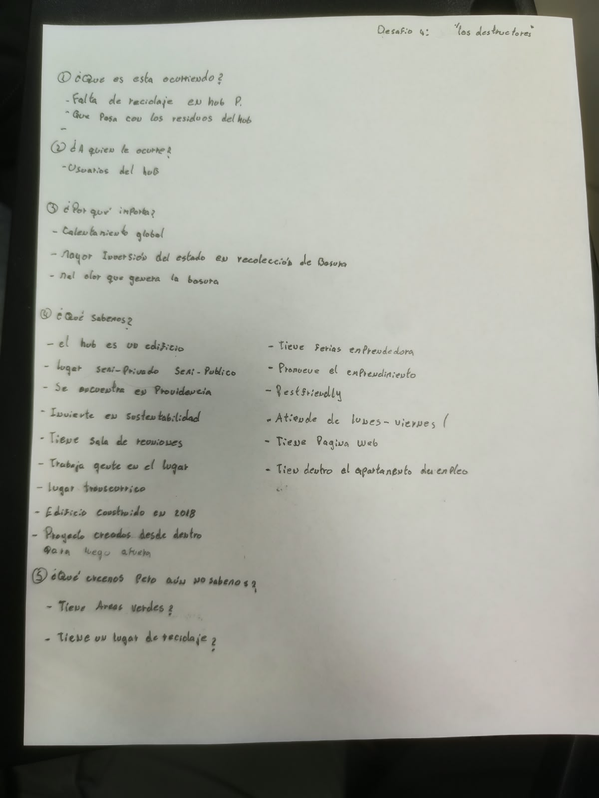
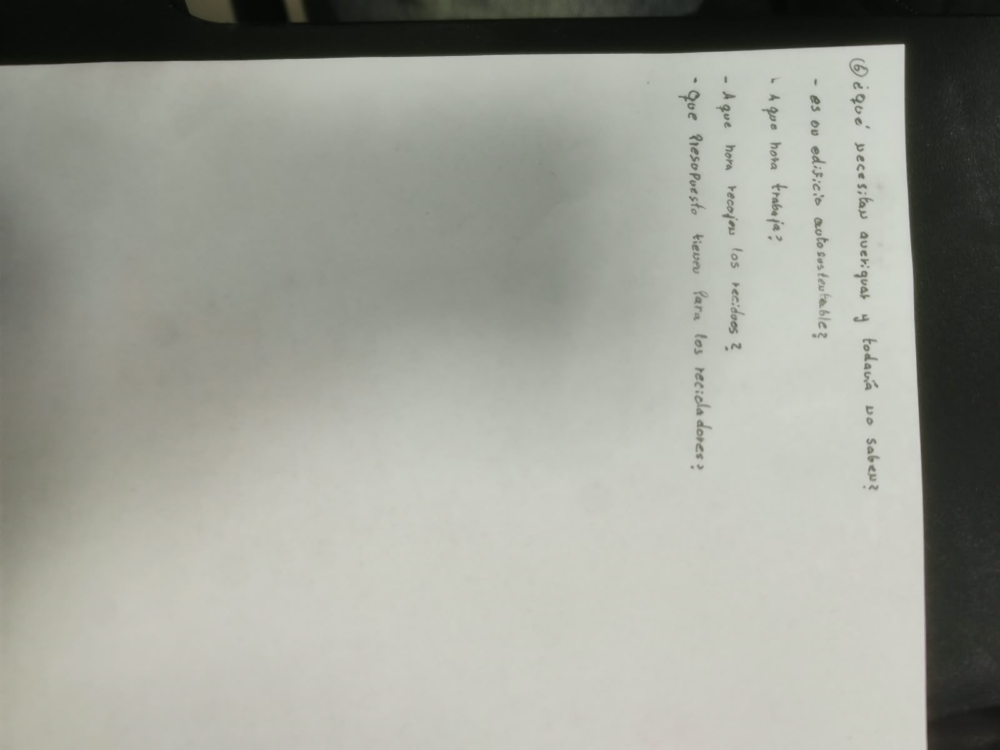

# S03 - Encuadre del problema y presentación del pitch

**Fecha:** 01-09-2026  
**Participantes:** Sebastián Díaz, Camila Gortaire, Jorge Ormazábal, Rivaldo Rodríguez, Sebastián Báez  
**Responsable del registro:** Sebastián Díaz

## Objetivo

Encuadrar el problema del desafío (qué ocurre, a quién, por qué importa, qué sabemos y qué falta) y presentar al curso el **pitch del tema** —no de la solución—, recibiendo retroalimentación del equipo docente.

## Actividades realizadas

1. **Actividad de encuadre del problema:** seis preguntas guía dictadas por la profesora, respondidas en equipo.
2. **Preparación del pitch:** reparto de bloques entre los cinco integrantes y armado de las láminas (una imagen por persona).
3. **Presentación del pitch** ante el curso: 5 minutos, participaron los cinco integrantes.
4. **Retroalimentación** de la profesora sobre la presentación.

## Evidencias

- Deck de la presentación: [../imagenes/S03/Pitch_de_presentacion.pdf](../imagenes/S03/Pitch_de_presentacion.pdf)

## Encuadre del problema (transcripción de la actividad)

**1. ¿Qué es lo que está ocurriendo?**
- Falta de reciclaje en el Hub Providencia.
- No se sabe qué pasa con los residuos que genera el Hub.

**2. ¿A quién le ocurre?**
- A las personas usuarias del Hub.

**3. ¿Por qué importa?**
- Calentamiento global.
- Mayor inversión del Estado en recolección de basura.
- Mal olor que genera la basura acumulada.

**4. ¿Qué sabemos?**
- El Hub es un edificio; un lugar semi-privado y semi-público.
- Se encuentra en Providencia.
- Invierte en sustentabilidad.
- Tiene sala de reuniones; trabaja gente en el lugar; es un lugar concurrido.
- Edificio asociado a un proyecto de 2018.
- Los proyectos se crean desde dentro para luego proyectarse hacia afuera.
- Tiene ferias de emprendimiento y promueve el emprendimiento.
- Es pet friendly.
- Atiende de lunes a viernes.
- Tiene página web.
- Dentro funciona la oficina de empleo.

**5. ¿Qué creemos pero aún no sabemos?**
- ¿Tiene áreas verdes?
- ¿Tiene un lugar de reciclaje?

**6. ¿Qué necesitamos averiguar y todavía no sabemos?**
- ¿Es un edificio autosustentable?
- ¿En qué horario funciona?
- ¿A qué hora / con qué frecuencia se retiran los residuos?
- ¿Qué presupuesto hay para el retiro y el reciclaje?

> Nota: varias afirmaciones del punto 4 vienen de conocimiento previo del equipo y todavía deben confirmarse con una fuente o con observación directa (ver retroalimentación más abajo).

## Resultados

- El encuadre dejó claro que, tal como lo entiende el equipo, el problema es la **falta de información sobre los residuos del Hub** (qué se genera y qué pasa con ellos), más que la ausencia total de reciclaje.
- Quedó una lista concreta de preguntas para llevar a la contraparte (puntos 5 y 6).
- La presentación se realizó completa, en el tiempo asignado y con la participación de los cinco integrantes.
- No se aplicó la coevaluación entre equipos. Aún no hay nota.

## Aprendizajes de comunicación oral y organización del pitch

De la sección de comunicación oral de la clase:

- Una presentación tiene tres etapas: **planificación**, **realización** y **evaluación**.
- Estructura de una charla breve: **gancho inicial → desarrollo → cierre**, en 5 minutos máximo.
- Láminas con poco texto y alto contraste; hablar pausado, sin muletillas; **ensayar para no depender de la lectura**.

Cómo organizamos el pitch: portada + una lámina por integrante (solo imagen), cada uno con sus ideas; reparto por bloque (qué es el Hub y el tema / situación problemática / consecuencias y magnitud / cultura y sensibilización / qué sabemos y cierre).

## Retroalimentación de la profesora

**Positivo:** claridad al presentar, cohesión y buena dinámica de equipo.

**A mejorar:**

1. Usar **fotografías reales** del Hub que muestren directamente el contexto y el problema, en lugar de imágenes genéricas.
2. Respaldar **toda afirmación** con datos, observaciones o fuentes registradas en la bitácora (es el propio valor del equipo, *"Rigor y evidencia"*). En la presentación aparecieron frases como *"la falta de señales genera…"* o *"existe falta de conciencia…"* sin evidencia que las sustente.
3. Levantar **evidencia en terreno antes de presentar**: visitar el Hub, fotografiar cómo se separan hoy los residuos, conversar con quienes usan el espacio, conocer la frecuencia del camión recolector y otros antecedentes de la situación actual.
4. En la exposición oral, lograr que **todos participen sin leer**.

## Decisiones y justificación

| Decisión | Motivo | Consecuencia |
|---|---|---|
| Coordinar una visita al Hub antes de seguir con el diagnóstico | La profesora pide evidencia de terreno y varias afirmaciones del encuadre están sin respaldo | Se agenda la visita; el diagnóstico se reescribe con lo observado |
| Reemplazar las imágenes del deck por fotos reales del Hub | Comentario directo de la retroalimentación | El deck se actualiza después de la visita |
| Anclar cada afirmación del diagnóstico a una fuente u observación | Coherencia con el valor "Rigor y evidencia" | Se revisa la lista de "qué sabemos" y se marca lo que falta confirmar |

## Errores, dificultades o riesgos

- En el pitch se usaron afirmaciones sin evidencia ("falta de señales", "falta de conciencia"); se corrigen anclándolas a observación o fuente.
- El deck usó imágenes genéricas en vez de fotos del lugar.
- Parte de la exposición se apoyó demasiado en la lectura.
- No se realizó la coevaluación entre equipos que contemplaba la clase.
- Riesgo: sin la visita al Hub, el diagnóstico se queda en supuestos.

## Aprendizajes

Un buen diagnóstico no se sostiene solo con lo que el equipo cree o con lo que se encuentra en internet: necesita observación directa y conversaciones con las personas del lugar. Además, el pitch se comunica mejor cuando cada integrante domina su parte sin leer.

## Tareas y responsables

| Tarea | Responsable(s) | Fecha límite | Estado |
|---|---|---|---|
| Subir las fotos de la actividad de encuadre a `imagenes/S03/` | Sebastián Díaz | 12-09-2026 | Pendiente |
| Subir el deck de la presentación (PDF) a `imagenes/S03/` | Sebastián Díaz | 12-09-2026 | Pendiente |
| Coordinar y realizar la visita al Hub (fotos, conversaciones, frecuencia de retiro) | Todo el equipo (coord. Jorge) | 15-09-2026 | Pendiente |
| Preparar pauta de observación y preguntas para la visita | Todo el equipo | 15-09-2026 | Pendiente |
| Actualizar el deck con fotos reales del Hub | Todo el equipo | Posterior a la visita | Pendiente |
| Revisar "qué sabemos" y marcar lo que falta confirmar con fuente | Sebastián Báez | 15-09-2026 | Pendiente |

## Próximo paso

Visita al Hub Providencia para levantar evidencia directa: fotografiar los puntos de generación y separación de residuos, conversar con personas usuarias y con el equipo de gestión, y averiguar la frecuencia del retiro. Con eso se reescribe el diagnóstico y se corrige el material de la presentación. Sabremos que resultó cuando cada afirmación del diagnóstico tenga una foto, una cita o una fuente que la respalde.

## Fuentes

- Enunciado del "Desafío 04 | Sostenibilidad", Curso Capstone Intermedio 2026, Universidad Mayor.
- Material del curso Capstone Intermedio 2026, Clase 3: comprensión del problema y comunicación oral.
- Actividad de encuadre del problema dictada en clase (elaboración propia del equipo, sesión S03).
- Retroalimentación escrita de la profesora sobre la presentación del 01-09-2026.
