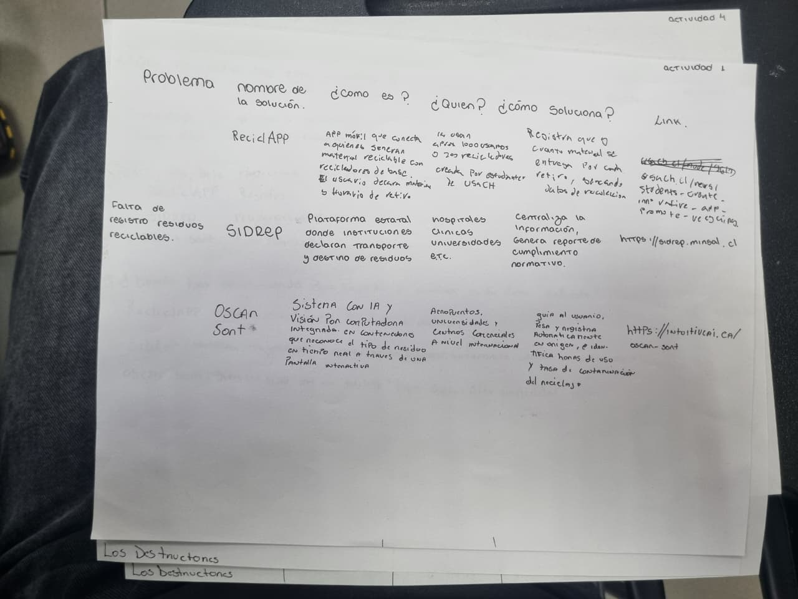
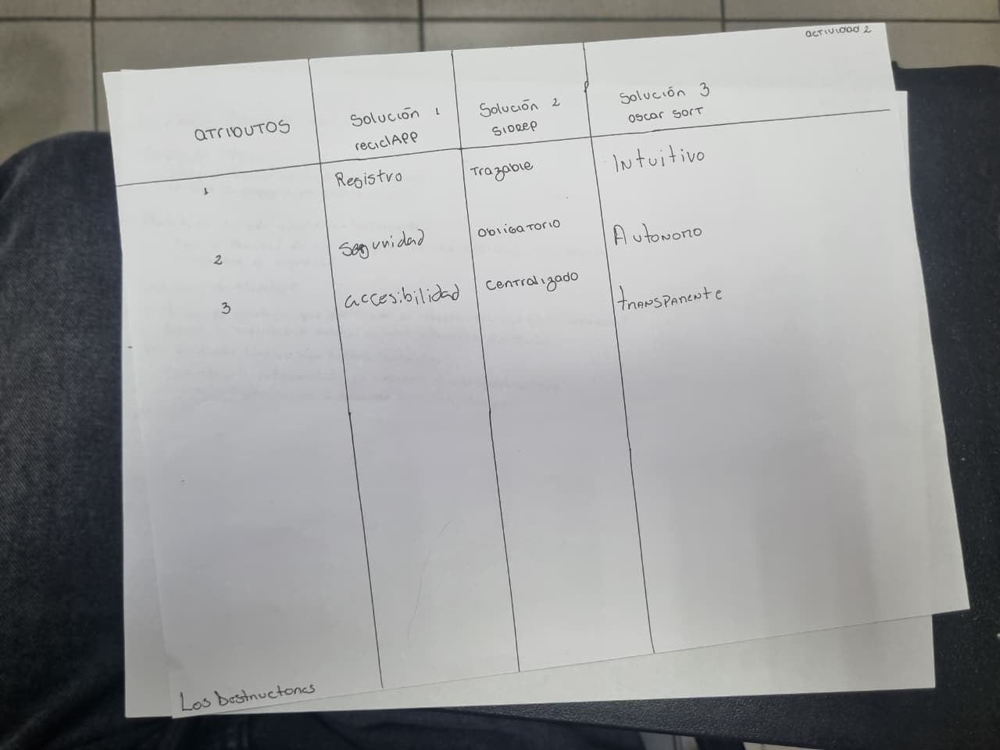
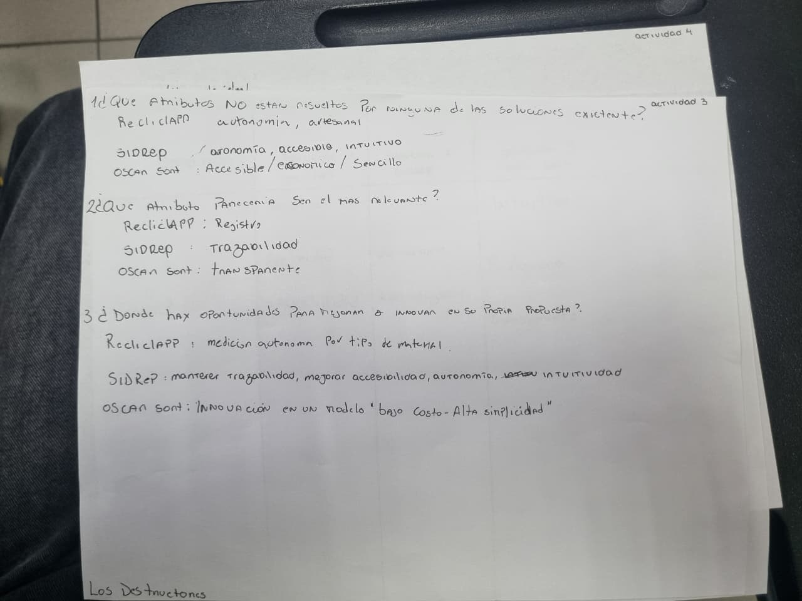
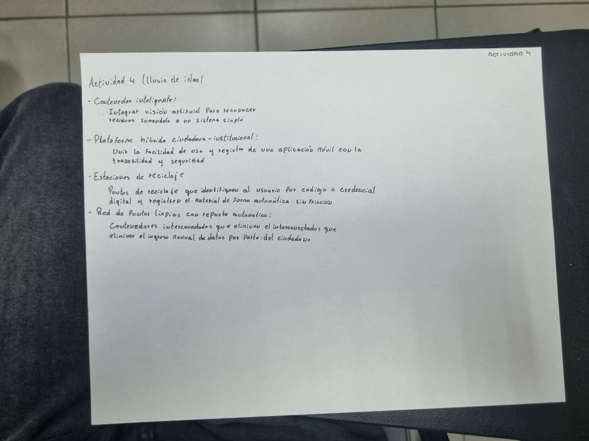
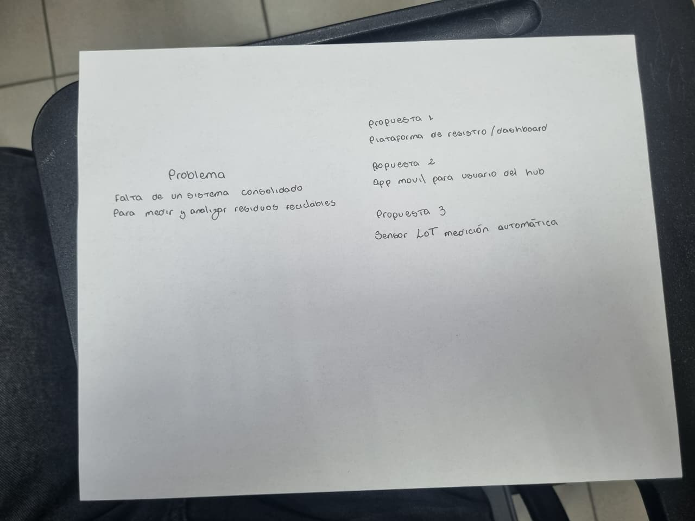

# S05 - Estado del arte, benchmark y oportunidades de solución

**Fecha:** 22-09-2026

**Participantes:** Sebastián Díaz, Camila Gortaire, Jorge Ormazábal, Rivaldo Rodríguez, Sebastián Báez

**Responsable del registro:** Sebastian Díaz

## Objetivo

Analizar soluciones existentes relacionadas con el registro, medición y gestión de residuos reciclables, comparar sus atributos e identificar oportunidades de solución aplicables al edificio del Hub Providencia.

## Alcance y criterio de evidencia

Esta entrada se construyó con las actividades de la clase, el enunciado y los antecedentes ya registrados en el repositorio y fuentes públicas enlazadas al final. Las ideas escritas durante la clase se conservan como producción del equipo, pero no se presentan automáticamente como hechos verificados.

## Actividades realizadas

1. Búsqueda de soluciones existentes y registro de sus enlaces.
2. Comparación de atributos mediante una matriz de benchmark.
3. Identificación de atributos no resueltos y oportunidades de innovación.
4. Segunda lluvia de ideas a partir de lo aprendido.
5. Profundización del problema y separación entre hechos, inferencias y preguntas pendientes.

## Evidencias de la sesión

## Lo que sabemos con respaldo

| Antecedente | Respaldo | Consecuencia para el proyecto |
|---|---|---|
| El alcance del desafío es el edificio del Hub, no toda la comuna de Providencia. | Enunciado y ficha del desafío. | La solución debe responder a una operación interna concreta. |
| Hub Providencia está ubicado en Los Jesuitas 881 y reúne espacios de innovación, cowork, reuniones, formación y prototipado. | Sitio oficial de la Municipalidad de Providencia. | Pueden existir distintos puntos y perfiles de generación; esto debe medirse en terreno. |
| LAB881 dispone de equipos de fabricación digital. | Sitio oficial de la Municipalidad de Providencia. | Es razonable investigar si sus residuos difieren de los de oficinas, pero no asumirlo sin observación. |
| Providencia opera recolección selectiva bajo Ley REP mediante ReSimple y define categorías de materiales aceptados. | Sitio municipal de Ley REP. | Conviene alinear las categorías internas con el sistema de retiro que efectivamente atienda al Hub. |
| En Chile existen sistemas oficiales de declaración de residuos. | SINADER, SIDREP y Ley 20.920. | Sirven como referencia de trazabilidad y cumplimiento, pero no necesariamente como interfaz cotidiana para usuarios del Hub. |
| Existen soluciones con aplicaciones, contenedores inteligentes, visión artificial, incentivos y paneles de datos. | Reciclapp, Oscar Sort y RedciclaCH. | Hay componentes reutilizables como referentes; aún debe evaluarse su pertinencia y costo para el Hub. |

## Lo que todavía no sabemos

1. Cuántos puntos de residuos o reciclaje existen dentro del Hub, dónde están y en qué estado se encuentran.
2. Qué materiales se generan realmente y en qué cantidad.
3. Qué espacios producen cada material y en qué horarios o eventos aumenta la generación.
4. Quién retira los residuos, con qué frecuencia y cuál es su destino.
5. Si el retiro depende de ReSimple, de un servicio municipal, de una empresa privada o de más de un actor.
6. Si existe alguna planilla, pesaje, comprobante o registro previo.
7. Qué nivel de contaminación o mezcla presentan los residuos separados.
8. Qué indicadores necesita la administración y con qué periodicidad.
9. Quién operaría la solución y cuánto trabajo manual puede asumir.
10. Qué restricciones existen para instalar sensores, modificar contenedores o almacenar datos.

Estas preguntas no se completan con búsqueda en internet: requieren visita, observación y conversación con la contraparte.

## Estado del arte

| Solución | Qué hace según su fuente | Aporte al benchmark | Límite frente al desafío del Hub |
|---|---|---|---|
| [Reciclapp](https://somosreciclapp.com/app/) | Conecta a personas que separan y declaran materiales con recicladores para coordinar su retiro; incorpora incentivos. | Registro por usuario, coordinación e incentivo. | Está orientada al retiro desde usuarios; no demuestra por sí sola medición interna consolidada de un edificio. |
| [SIDREP](https://www.leychile.cl/navegar?idNorma=252307) | Sistema de declaración y seguimiento de residuos peligrosos. | Referente de trazabilidad formal. | Los reciclables comunes del desafío no deben clasificarse como peligrosos sin evidencia; su alcance regulatorio es distinto. |
| [SINADER](https://portalvu.mma.gob.cl/sinader/) | Permite declarar residuos no peligrosos por parte de generadores, destinatarios, gestores y municipios. | Referente nacional más cercano para registro consolidado de residuos no peligrosos. | Es un sistema de declaración ambiental, no una solución de captura cotidiana dentro del Hub. |
| [Oscar Sort](https://intuitiveai.ca/oscar-sort) | Utiliza inteligencia artificial para orientar la separación y generar analítica de residuos. | Reconocimiento, guía al usuario y datos automáticos. | Requiere evaluar costo, infraestructura, soporte y pertinencia local. |
| [RedciclaCH](https://redciclach.com/) | Ofrece contenedores inteligentes, educación, incentivos y trazabilidad. | Integra interacción del usuario y medición. | Debe comprobarse qué variables mide y si puede adaptarse al flujo actual del Hub. |
| [ReSimple / Ley REP en Providencia](https://providencia.cl/provi/vive/medioambiente/ley-rep/ley-de-responsabilidad-extendida-del-productor-rep) | Gestiona recolección selectiva de envases y embalajes en la comuna bajo Ley REP. | Define categorías y un circuito real de recolección local. | No sustituye el registro interno del edificio ni confirma que actualmente retire desde el Hub. |

## Benchmark por atributos

La matriz manuscrita usó conceptos como registro, trazabilidad, autonomía, accesibilidad, transparencia e intuitividad. Se reorganizaron para comparar funciones observables y evitar calificativos sin respaldo.

| Atributo | Reciclapp | SIDREP | SINADER | Oscar Sort | RedciclaCH | ReSimple / Providencia |
|---|---|---|---|---|---|---|
| Registro de datos | Declaración de materiales por usuario | Declaración regulada de residuos peligrosos | Declaración de residuos no peligrosos | Analítica automatizada | Registro asociado al contenedor | Registro del sistema de recolección, no del flujo interno del Hub |
| Trazabilidad | Coordinación de retiro | Alta, dentro de su alcance regulatorio | Formal, según declaraciones | Seguimiento y analítica reportada por el proveedor | Declarada por el proveedor | Trazabilidad del sistema REP; falta comprobar el vínculo con el Hub |
| Baja carga manual | Parcial | No es su objetivo | No es su objetivo | Alta automatización declarada | Automatización declarada | El retiro es externo, pero el registro interno sigue abierto |
| Orientación al usuario | Aplicación e incentivos | Enfocada en actores regulados | Enfocada en declarantes | Guía de separación en el punto | Interacción e incentivos | Información pública sobre separación |
| Panel o reporte | Información de actividad del usuario | Reporte regulatorio | Reporte regulatorio | Analítica y reportes | Plataforma de trazabilidad | Información de gestión comunal |
| Ajuste comprobado al Hub | No | No | No | No | Existe un antecedente de piloto municipal, no en el edificio del Hub | Debe verificarse si el Hub forma parte del circuito actual |

## Respuestas de la Actividad 3

### 1. ¿Qué atributos no están resueltos en conjunto por las soluciones revisadas?

Ninguna fuente revisada demuestra, para el contexto específico del Hub, la combinación completa de:

- medición por material, punto y fecha;
- trazabilidad desde la separación hasta el retiro;
- baja carga operativa;
- un panel simple para la administración;
- orientación comprensible para las personas usuarias;
- compatibilidad con el circuito real de recolección del edificio.

### 2. ¿Cuál parece ser el atributo más relevante?

El atributo central es un **registro medible y trazable**. Sin datos confiables no se puede construir una línea base, evaluar recuperación, detectar problemas ni generar indicadores. La automatización, la accesibilidad y los incentivos solo agregan valor si la medición base es válida.

### 3. ¿Dónde aparecen oportunidades para mejorar o innovar?

- Registrar material, cantidad, punto y fecha con el menor trabajo manual posible.
- Relacionar el registro interno con el retiro y destino real de los residuos.
- Mostrar pocos indicadores accionables para la administración.
- Utilizar categorías compatibles con el sistema que atienda al Hub.
- Entregar retroalimentación visible a usuarios sin afirmar que los incentivos sean necesarios antes de probarlo.
- Comenzar con un piloto pequeño y medible antes de instalar sensores o inteligencia artificial.

## Segunda lluvia de ideas

| Idea surgida | Valor potencial | Validación necesaria |
|---|---|---|
| Plataforma de registro y dashboard | Centraliza datos e indicadores. | Saber quién ingresa los datos y qué indicadores se necesitan. |
| Aplicación móvil para usuarios del Hub | Facilita declaraciones y retroalimentación. | Comprobar que las personas usarían una aplicación adicional. |
| Sensor IoT de medición automática | Reduce registros manuales. | Definir qué variable mide, precisión, energía, conectividad, costo y mantenimiento. |
| Contenedor inteligente | Integra captura de datos y guía de separación. | Probar materiales, volumen, ubicación y operación real. |
| Plataforma híbrida ciudadana-institucional | Combina facilidad de uso con trazabilidad administrativa. | Definir roles, datos mínimos y privacidad. |
| Red de puntos con reporte automático | Permite comparar zonas del edificio. | Confirmar cuántos puntos existen y si se justifica instrumentarlos. |

## Decisiones de la sesión

| Decisión | Fundamento | Consecuencia |
|---|---|---|
| Mantener abierta más de una alternativa de solución. | Todavía faltan datos del flujo real y de la operación del Hub. | No seleccionar aún aplicación, sensor o contenedor. |
| Priorizar medición y trazabilidad por sobre funciones accesorias. | Son necesarias para responder al objetivo del desafío. | Las ideas se evaluarán primero por calidad del dato y carga operativa. |
| Incorporar SINADER y precisar el alcance de SIDREP. | Evita confundir residuos reciclables comunes con residuos peligrosos. | El benchmark queda regulatoriamente mejor delimitado. |
| Usar la visita al Hub como siguiente fuente de evidencia. | Varias preguntas críticas no se resuelven con fuentes públicas. | Preparar una pauta de observación y entrevista. |

## Riesgos y precauciones

- Diseñar una solución tecnológica antes de conocer el proceso actual.
- Presentar atributos comerciales como eficacia comprobada en el Hub.
- Confundir cantidad de residuos generados con cantidad efectivamente recuperada.
- Medir unidades, volumen y peso como si fueran equivalentes.
- Crear un sistema que dependa de registros manuales que nadie tenga tiempo de mantener.
- Exponer datos personales cuando bastan registros agregados del edificio.

## Próximas tareas

| Tarea | Responsable(s) | Estado |
|---|---|---|
| Visitar el Hub y mapear puntos, materiales y responsables. | Todo el equipo | Pendiente |
| Preguntar qué indicadores necesita la administración. | Todo el equipo | Pendiente |
| Levantar una línea base inicial con unidad de medición definida. | Por asignar | Pendiente |
| Evaluar las ideas con evidencia de terreno y escoger un piloto. | Todo el equipo | Pendiente |

## Fuentes consultadas

1. Enunciado del "Desafío 04 | Sostenibilidad", Curso Capstone Intermedio 2026, Universidad Mayor.
2. Material del curso Capstone Intermedio 2026, Clase 6: propuestas conceptuales, estado del arte y benchmark.
3. Actividades manuscritas del equipo, sesión S05.
4. Municipalidad de Providencia. [Hub Providencia](https://providencia.cl/provi/comunidad/hub-providencia/innovacion).
5. Municipalidad de Providencia. [LAB881, laboratorio municipal de impresión 3D](https://providencia.cl/provi/explora/noticias/hub-providencia/lab881-el-primer-laboratorio-municipal-de-impresion-3d-del-pais).
6. Municipalidad de Providencia. [Ley REP en Providencia](https://providencia.cl/provi/vive/medioambiente/ley-rep/ley-de-responsabilidad-extendida-del-productor-rep).
7. Ministerio del Medio Ambiente. [SINADER](https://portalvu.mma.gob.cl/sinader/).
8. Biblioteca del Congreso Nacional. [Reglamento del Sistema de Declaración y Seguimiento de Residuos Peligrosos](https://www.leychile.cl/navegar?idNorma=252307).
9. Biblioteca del Congreso Nacional. [Ley 20.920](https://nuevo.leychile.cl/navegar?idNorma=1090894).
10. Reciclapp. [Aplicación Reciclapp](https://somosreciclapp.com/app/).
11. Intuitive AI. [Oscar Sort](https://intuitiveai.ca/oscar-sort).
12. RedciclaCH. [Soluciones de reciclaje inteligente](https://redciclach.com/).
13. Municipalidad de Providencia. [Piloto de contenedor inteligente de RedciclaCH](https://providencia.cl/provi/site/artic/20211108/pags/20211108165406.html).

## Próximo paso

Realizar la visita al Hub
